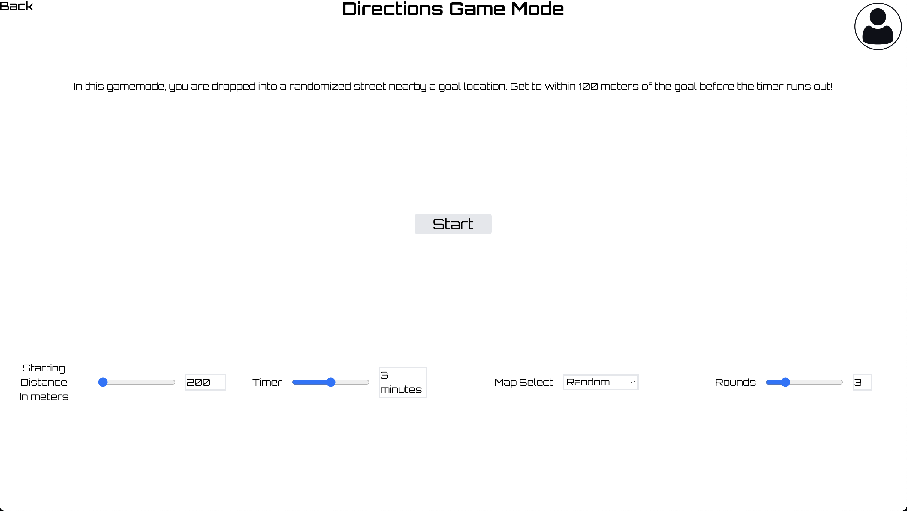
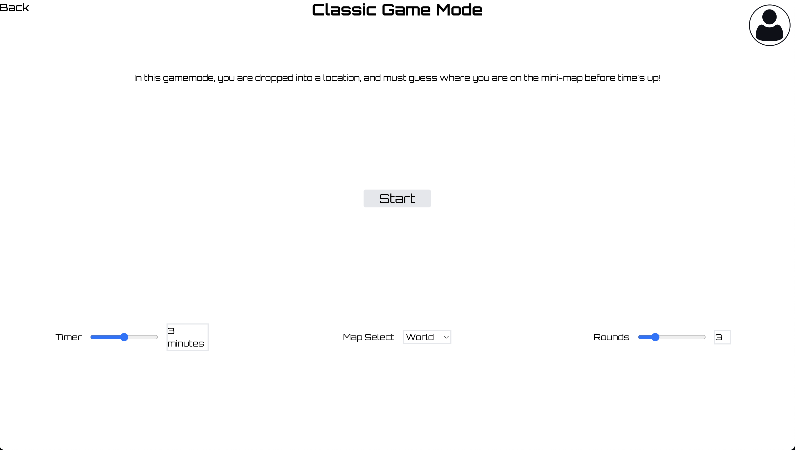

# GeoTrekker

GeoTrekker is a web-based geolocation guessing game built with the Google Maps Javascript API. 

## Table of Contents

* [Installation](#installation)
* [Usage](#usage)
* [Features](#features)

## Installation

1. Obtain a Google API key: Go to the [Google Cloud Console](https://console.cloud.google.com/) and follow the instructions on how to obtain an API key for access to the Google Maps Javascript API
2. Clone the repository  `git clone https://github.com/Riixardo/GeoTrekker.git`
3. Install dependencies: First run `cd backend` and then `npm install` to download the backend dependencies. Next, `cd ..` then `cd frontend` and finally `npm install` to download the frontend dependencies.
4. Paste your API key: Head over to `/frontend/public/apiConfig.js` and paste the Google API key into the `API_KEY` field.

### Setting up the database
1. Set up a PostgreSQL database: Download [PostgresSQL](https://www.postgresql.org/download/) and create a database or find a third-party application and host the database on their servers.
2. Go to `/backend/db/dbSetup/dbInit.sql` and execute this file in your database to create a new schema named GeoTrekker with some sample locations
3. Head over to `/backend/config.dbconfig.js` and input the fields to connect to your database

## Usage
cd into the `backend` folder and run `npm run dev` or `node index.js` to start the backend server. Then, cd into the `frontend` folder and run `npm start` to start the webpage.

### Adding or Deleting Locations
In `/backend/db/dbHelper`, there is a file `dbMapHelper.js`. Run this file to access small CLI for inserting and deleting locations within your database. Documentation can be found for the file at `/backend/db/docs/index.html`

Example formatted input for inserting a classic location: `[{"mapID": 1, "lat": 45.2323232323, "lng": -2.3245533445}, {"mapID": 2, "lat": 85.2323232323, "lng": -22.3245533445}, {"mapID": 3, "lat": 14.2323232323, "lng": -9.3245533445}]` (Fake Example Locations)

## Features

### Directions Game Mode

This game mode involves being spawned in a random location a set distance away from a goal location. The objective is to use Google Street View to navigate within 100
meters of the goal before time runs out. 

 Directions Game Mode Selection Screen

 Directions Game Mode In-Game Example

### Classic Game Mode

This game mode is like popular websites like GeoGuessr, where the user is dropped into a random location and has to guess where they are in the on-screen mini-map

 Classic Game Mode Selection Screen

 Classic Game Mode In-Game Example

